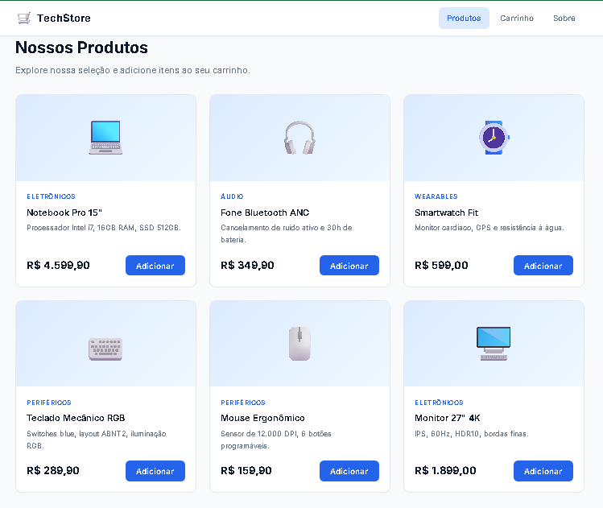

# 🛒 QA Manual Portfolio - E-commerce

> Projeto criado para demonstrar o processo completo de Qualidade de Software (QA Manual) em uma aplicação Web de E-commerce.

---

## 🚀 Objetivo

Simular o trabalho de um Analista de QA Manual desde o planejamento dos testes até o registro de bugs e evidências.
---
## 📷 Visão Geral da Aplicação

---
## 🛠 Tecnologias Utilizadas

- HTML
- CSS
- JavaScript
- Git
- GitHub
- Jira
- Cursor

## 📑 Índice

- Sobre o Projeto
- Funcionalidades
- Tecnologias
- Estrutura do Projeto
- Casos de Teste
- Cenários Gherkin
- Execução dos Testes
- Bugs Encontrados
- Evidências
- Como Executar
- Aprendizados

## 📖 Sobre o Projeto

Este projeto foi desenvolvido como parte da minha preparação para atuar como Analista de QA Manual.

Durante o desenvolvimento realizei:

- Planejamento dos testes;
- Criação dos casos de teste;
- Escrita de cenários em Gherkin;
- Organização das atividades utilizando Jira;
- Execução dos testes;
Execução de testes exploratórios;
- Registro dos bugs encontrados;
- Registro das evidências.

> Este repositório reúne todas essas etapas para demonstrar meu processo de trabalho e evolução na área de Qualidade de Software.

## 📂 Estrutura do Projeto

portfolio-qa-ecommerce
│
├── 📁 app
├── 📁 docs
├── 📁 test-cases
├── 📁 gherkin
├── 📁 jira
├── 📁 bugs
├── 📁 evidencias
└── 📁 imagens
├── 📁 test-sessions